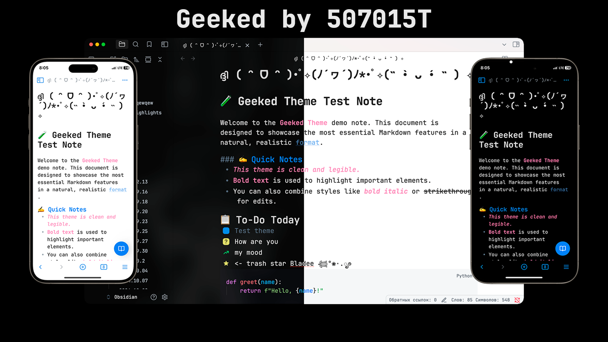
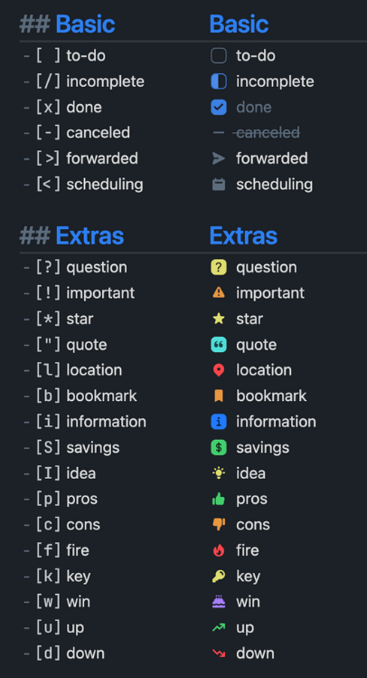

# Geeked Theme for Obsidian

**Geeked** is a refined hybrid theme based on the [Things theme](https://github.com/colineckert/obsidian-things.git) and the [Transient theme](https://github.com/GeorgeAzma/Transient.git).

It combines the structured clarity of Things with the futuristic aesthetics of Transient — but without the usability issues.



## 🔧 Fixes Over Transient

While Transient looked beautiful, it had several practical issues — especially with **excessive transparency**, making many fields unreadable or invisible.

**Geeked solves those problems** by carefully balancing transparency and contrast. Every panel, modal, and input field is clearly visible and usable across both light and dark modes.

## 🌙 Dark Mode

On mobile devices with **OLED or AMOLED displays**, Geeked's dark mode is especially effective — black pixels are fully turned off, which not only saves battery but also reduces eye strain during night-time use.

## ☀️ Light Mode

**Default light Things theme**

## 🎨 Theme Highlights

- Optional translucent backgrounds (works great on macOS)
- Plugin-friendly and stable
- Clean typography and layout structure
- Fully readable UI in both modes

## 🛠 CheckBox Styling

Geeked(inherited from Things) supports a wide number of alternate checkbox types. These allow you to call out tasks that are incomplete, canceled, rescheduled, etc. See below for availale checkbox types.



```
## Basic
- [ ] to-do
- [/] incomplete
- [x] done
- [-] canceled
- [>] forwarded
- [<] scheduling

## Extras
- [?] question
- [!] important
- [*] star
- ["] quote
- [l] location
- [b] bookmark
- [i] information
- [S] savings
- [I] idea
- [p] pros
- [c] cons
- [f] fire
- [k] key
- [w] win
- [u] up
- [d] down
- [D] draft pull request
- [P] open pull request
- [M] merged pull request
```

## Installation

### Obsidian Marketplace (Recommended)

1. Open the **Settings** in Obsidian
2. Navigate to **Appearances** tab under **Options**
3. Under the **Themes** section, click on the `Manage` button across from **Themes**
4. Search for `Geeked` in the Filter text input
5. Click `Use` and then you're done! 🎉

### Manual

1. Download this repo
2. Copy the `theme.css` file into your vault's `/.obsidian/themes` directory
3. Rename the file to `Geeked.css` so it will have a unique name in the theme selection dropdown
4. Open the **Settings** in Obsidian
5. Navigate to **Appearances** tab under **Options**
6. Under the **Themes** section, click on the dropdown menu next to **Theme** heading
7. Select `Geeked` and then you're done! 🎉

## Configuration

1. Appearance > Translucent Window > ON
2. Appearance > Window Frame Style > Obsidian Frame
3. Appearance > Show Tab Title Bar > OFF


---

_A theme for those who want both form and function, day and night._
