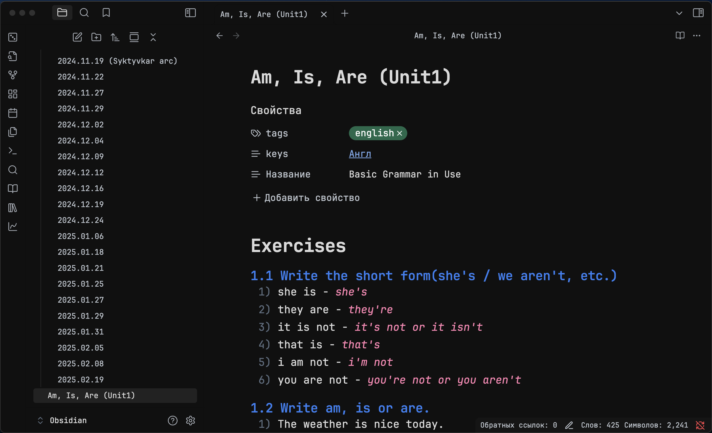
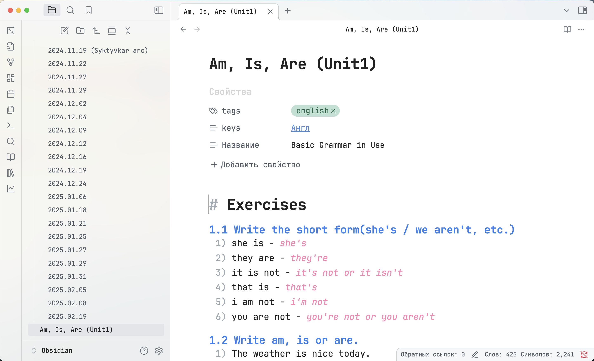
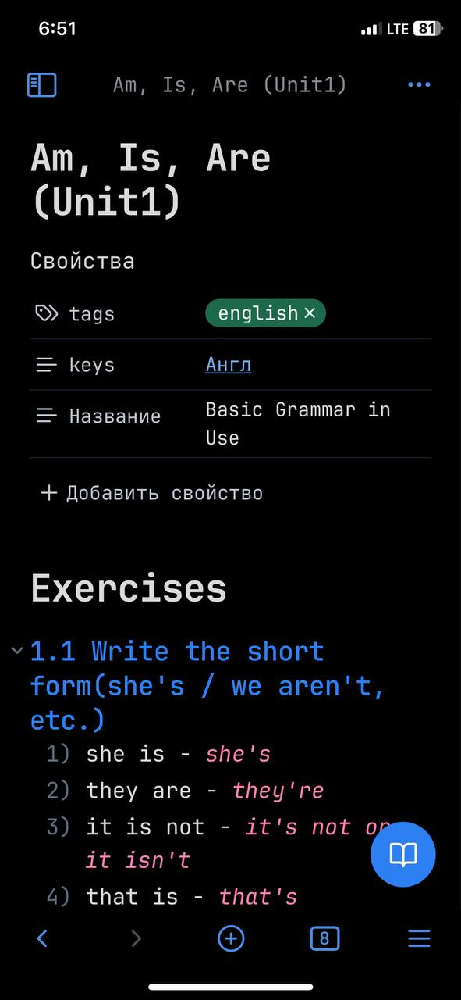
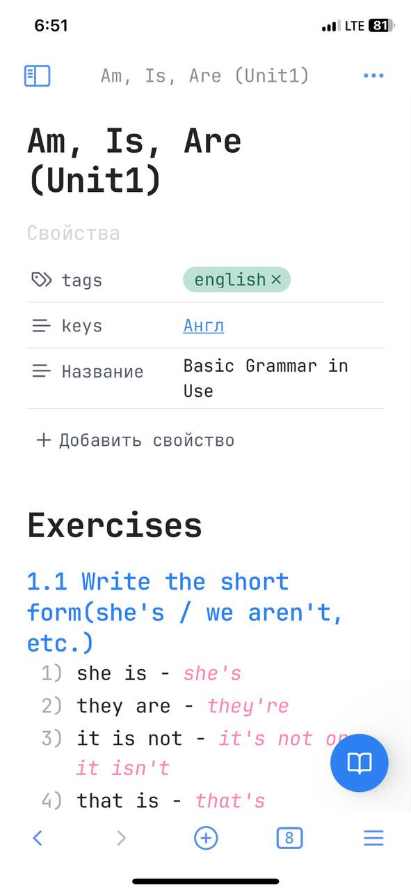
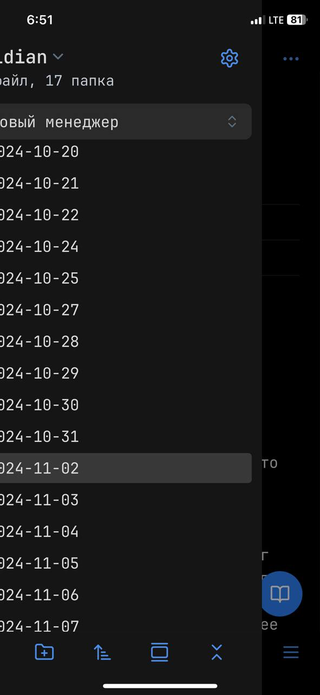

# Geeked Theme for Obsidian

**Geeked** is a refined hybrid theme based on the [Things theme](https://github.com/colineckert/obsidian-things.git) and the [Transient theme](https://github.com/GeorgeAzma/Transient.git).

It combines the structured clarity of Things with the futuristic aesthetics of Transient — but without the usability issues.

## 🔧 Fixes Over Transient

While Transient looked beautiful, it had several practical issues — especially with **excessive transparency**, making many fields unreadable or invisible.

**Geeked solves those problems** by carefully balancing transparency and contrast. Every panel, modal, and input field is clearly visible and usable across both light and dark modes.

## 🌙 Dark Mode

**Subtle neon, soft shadows, and calm contrast — perfect for night use.**



## ☀️ Light Mode

**Minimal, bright, and readable — designed for daylight work.**



## 📱 Mobile Experience

Geeked is also optimized for **mobile use**, with properly scaled UI elements, clear input fields, and no visual glitches on touchscreens.

- 
- 
- 

## 🎨 Theme Highlights

- Optional translucent backgrounds (works great on macOS)
- Plugin-friendly and stable
- Clean typography and layout structure
- Fully readable UI in both modes

## 🛠 CheckBox Styling

Geeked(inherited from Things) supports a wide number of alternate checkbox types. These allow you to call out tasks that are incomplete, canceled, rescheduled, etc. See below for availale checkbox types.


```
## Basic
- [ ] to-do
- [/] incomplete
- [x] done
- [-] canceled
- [>] forwarded
- [<] scheduling

## Extras
- [?] question
- [!] important
- [*] star
- ["] quote
- [l] location
- [b] bookmark
- [i] information
- [S] savings
- [I] idea
- [p] pros
- [c] cons
- [f] fire
- [k] key
- [w] win
- [u] up
- [d] down
- [D] draft pull request
- [P] open pull request
- [M] merged pull request
```

## Installation

### Obsidian Marketplace (Recommended)

1. Open the **Settings** in Obsidian
1. Navigate to **Appearances** tab under **Options**
1. Under the **Themes** section, click on the `Manage` button across from **Themes**
1. Search for `Geeked` in the Filter text input
1. Click `Use` and then you're done! 🎉

### Manual

1. Download this repo
1. Copy the `theme.css` file into your vault's `/.obsidian/themes` directory
1. Rename the file to `Geeked.css` so it will have a unique name in the theme selection dropdown
1. Open the **Settings** in Obsidian
1. Navigate to **Appearances** tab under **Options**
1. Under the **Themes** section, click on the dropdown menu next to **Theme** heading
1. Select `Geeked` and then you're done! 🎉

---

_A theme for those who want both form and function, day and night._
